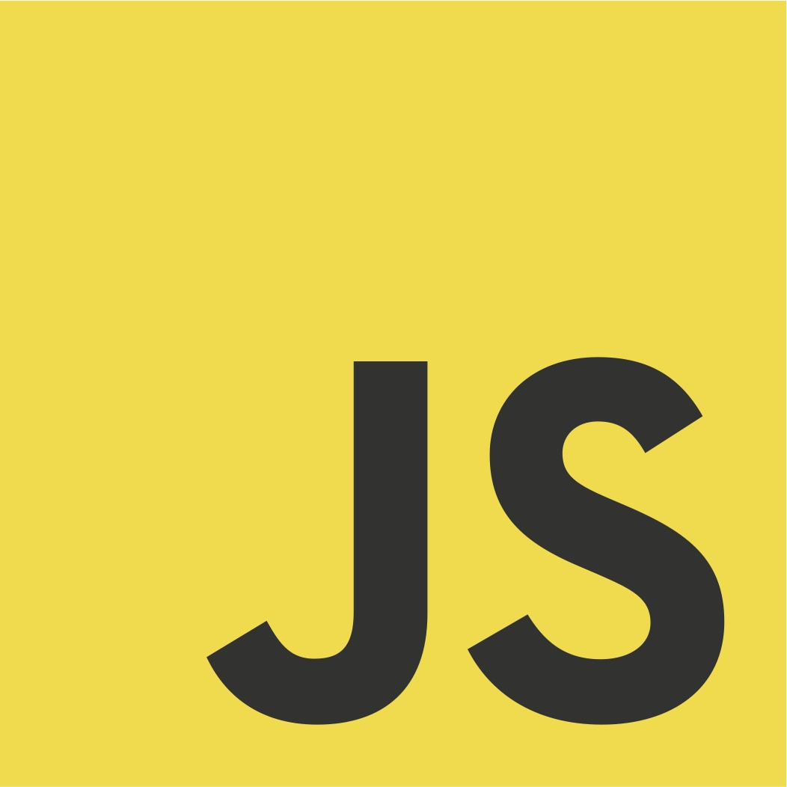

# Budget-Tracker

## Table of Contents
* <a href="#about">Link</a>
* <a href="#about">About</a>
* <a href="#preview">Preview</a>
* <a href="#user-story">User Story</a>
* <a href="#acceptance-criteria">Acceptance Criteria</a>
* <a href="#technologies">Technologies</a>

## Link
<b>Link to site:</b> 

## About 
<i><b>Budget Tracker</b></i> is a website that allows the user to be able to add expenses and deposits to their budget with or without a connection. When entering transactions offline, they should populate the total when brought back online. Giving users a fast and easy way to track their money is important, but allowing them to access that information anytime is even more important. Having offline functionality is paramount to the applications success.


## Preview


## User Story
```
AS AN avid traveller
I WANT to be able to track my withdrawals and deposits with or without a data/internet connection
SO THAT my account balance is accurate when I am traveling
```

## Acceptance Criteria
```
GIVEN a user is on Budget App without an internet connection
WHEN the user inputs a withdrawal or deposit
THEN that will be shown on the page, and added to their transaction history when their connection is back online.
```


## Technologies
<!-- ### Front End
&nbsp; &nbsp;
&nbsp; &nbsp; &nbsp; 
&nbsp; &nbsp; &nbsp; 


### Back End
&nbsp; &nbsp; &nbsp; 
&nbsp; &nbsp; &nbsp; 
&nbsp; &nbsp; &nbsp; 
 -->